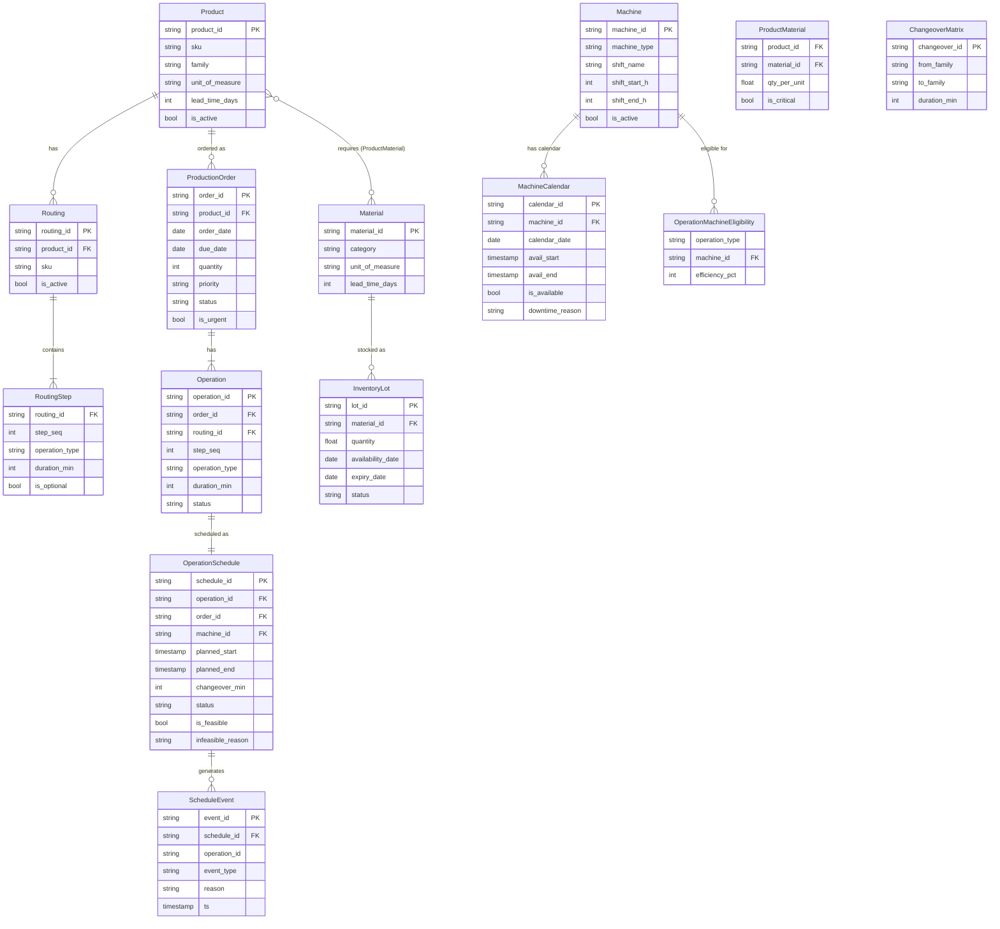

# ER Diagram (Mermaid)

```mermaid
erDiagram
    Product {
        string product_id PK
        string sku
        string family
        string unit_of_measure
        int    lead_time_days
        bool   is_active
    }

    Routing {
        string routing_id PK
        string product_id FK
        string sku
        bool   is_active
    }

    RoutingStep {
        string routing_id FK
        int    step_seq
        string operation_type
        int    duration_min
        bool   is_optional
    }

    Machine {
        string  machine_id PK
        string  machine_type
        string  shift_name
        int     shift_start_h
        int     shift_end_h
        bool    is_active
    }

    MachineCalendar {
        string    calendar_id PK
        string    machine_id FK
        date      calendar_date
        timestamp avail_start
        timestamp avail_end
        bool      is_available
        string    downtime_reason
    }

    Material {
        string material_id PK
        string category
        string unit_of_measure
        int    lead_time_days
    }

    InventoryLot {
        string  lot_id PK
        string  material_id FK
        float   quantity
        date    availability_date
        date    expiry_date
        string  status
    }

    ProductMaterial {
        string product_id FK
        string material_id FK
        float  qty_per_unit
        bool   is_critical
    }

    OperationMachineEligibility {
        string operation_type
        string machine_id FK
        int    efficiency_pct
    }

    ChangeoverMatrix {
        string changeover_id PK
        string from_family
        string to_family
        int    duration_min
    }

    ProductionOrder {
        string order_id PK
        string product_id FK
        date   order_date
        date   due_date
        int    quantity
        string priority
        string status
        bool   is_urgent
    }

    Operation {
        string operation_id PK
        string order_id FK
        string routing_id FK
        int    step_seq
        string operation_type
        int    duration_min
        string status
    }

    OperationSchedule {
        string    schedule_id PK
        string    operation_id FK
        string    order_id FK
        string    machine_id FK
        timestamp planned_start
        timestamp planned_end
        int       changeover_min
        string    status
        bool      is_feasible
        string    infeasible_reason
    }

    ScheduleEvent {
        string    event_id PK
        string    schedule_id FK
        string    operation_id
        string    event_type
        string    reason
        timestamp ts
    }

    Product         ||--o{ Routing              : "has"
    Routing         ||--|{ RoutingStep           : "contains"
    Product         ||--o{ ProductionOrder       : "ordered as"
    ProductionOrder ||--|{ Operation             : "has"
    Operation       ||--|| OperationSchedule     : "scheduled as"
    Machine         ||--o{ MachineCalendar       : "has calendar"
    Machine         ||--o{ OperationMachineEligibility : "eligible for"
    OperationSchedule ||--o{ ScheduleEvent       : "generates"
    Product         }o--o{ Material              : "requires (ProductMaterial)"
    Material        ||--o{ InventoryLot          : "stocked as"
```
